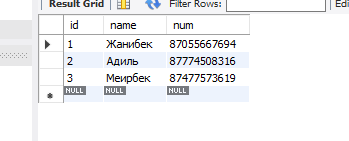

# BMK03_JDBC_SQL

Решение 2 лабараторной работы.<br/>
Вариант - 4 (Блокнот).<br/>
Реализация программы с использованием технологии JDBC и базы данных. Программа вводит, модифицирует и выводит данные на экран с использованием класса и его отображения через JDBC.





```
CREATE TABLE IF NOT EXISTS `notebook` (
    `id` INT(3) NOT NULL AUTO_INCREMENT,
    `name` VARCHAR(20) NOT NULL,
    `num` VARCHAR(20) NOT NULL,
    PRIMARY KEY (`id`)
)  ENGINE=INNODB DEFAULT CHARSET=UTF8;

INSERT INTO notebook (`name`, num) VALUES ("Жанибек", "87055667439");
INSERT INTO notebook (`name`, num) VALUES ("Адиль", "87774507735");
INSERT INTO notebook (`name`, num) VALUES ("Меирбек", "87477573365");

SET GLOBAL time_zone = '+6:00';

```
